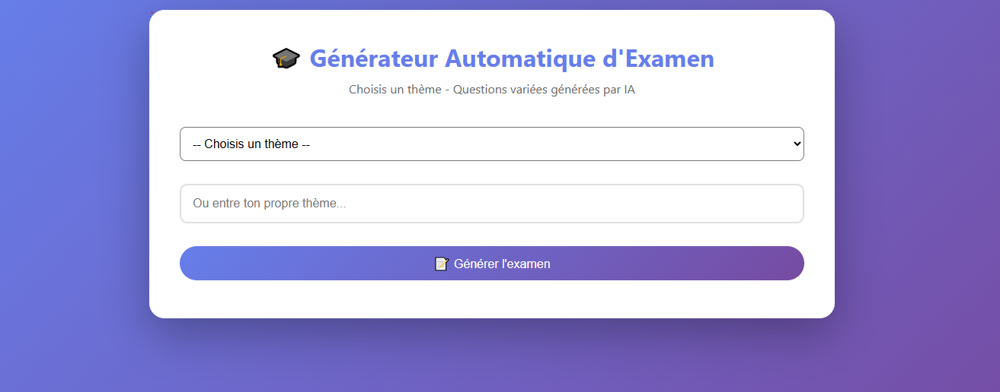
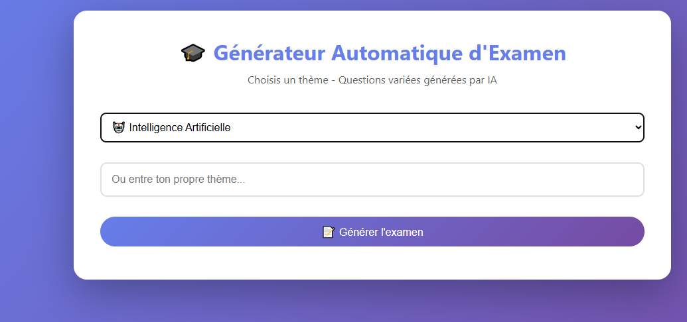
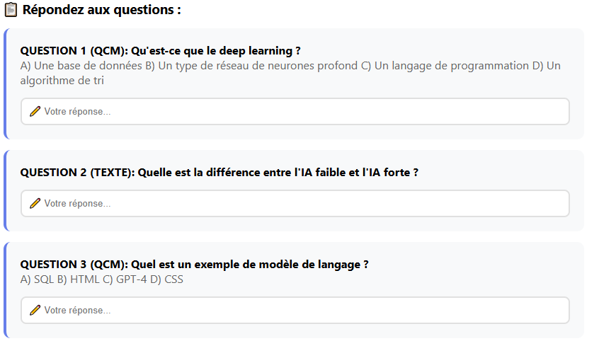
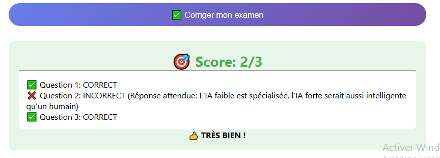

# Projet 13 🎓 Génération automatique de questions d’examen et correction
# Description :
Application web qui génère automatiquement des questions d'examen et corrige les réponses.
## Captures d'écran

## Modèle génératif utilisé
- **LLM** : Llama 3.3 70B (Meta) via Groq API
- **Preuve** : Fichier `generateur_llm.ipynb`
## Auteurs
Cheikh Malèk
Dhaouadi Jihen
2ème sic
